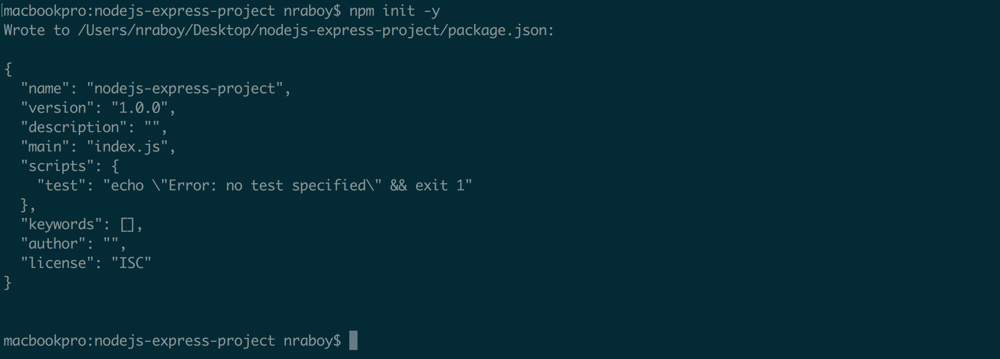

:couchbase_version: current
:toc:
:project_id: gs-nodejs-express
:icons: font
:source-highlighter: prettify

= Getting Started with Couchbase on Node.js using Express Framework

This guide walks you through the process of creating a "hello world" Node.js web application that uses link:http://developer.couchbase.com[Couchbase].

== What You'll Build

You'll build a website that will run on your development machine. You will access it through your browser at an address like:

----
http://localhost:3000/
----

With this website, you'll be able to perform the basic CRUD (Create,Read,Update,Delete) operations.

In this demonstration, you'll be interacting with information about people: their name, their address, etc. The Couchbase database will contain one "bucket" that only contains people. Each person document will be represented in JSON:

[source,json]
----
{"firstName": "Nic", "lastName": "Raboy"}
----

== What You'll Need

* 10 minutes
* link:https://nodejs.org[Node.js] 4 or higher
* link:https://curl.haxx.se/download.html[cURL] or similar
* link:http://www.couchbase.com/nosql-databases/downloads[Couchbase Server 4.1+] (follow the instructions to install Couchbase)

== How to Complete This Guide

This guide assumes you have some familiarity with the Node.js and the Express framework. You should understand at least the basics of JavaScript and the Node Package Manager (NPM).

== Build Setup

You can start from scratch via a Command Prompt or Terminal if you'd like.  Using a Command Prompt or Terminal, execute the following to create a new Node.js project:

----
npm init -y
----

The results should look something like the following:

There are a few Express and Couchbase dependencies that must be installed to the project.  These can be installed via Command Prompt or Terminal by executing:

----
npm install express couchbase body-parser --save
----

All packages will be installed to a *node_modules* directory that sits next to the *package.json* file that was created when initializing the project.

If this is a fresh project, create an *app.js* file to sit next to the *package.json* file.  For simplicity, all Node.js code will exist in this file.

== Code

Now that we're starting from a common baseline, let's start writing some code to use Couchbase.

==== Importing the Necessary Dependencies

The Express framework and Couchbase SDK dependencies were downloaded, but not yet included in the project.  The dependencies can be included in the project's *app.js* file like the following:

[source,javascript]
----
var express = require("express");
var couchbase = require("couchbase");
var bodyParser = require("body-parser");
----

==== Establishing a Connection to Couchbase

A connection to a Couchbase cluster and opening up a Bucket can be accomplished with as little as one line of code.  For simplicity, this will be broken up into the following two lines:

[source,javascript]
----
var cluster = new couchbase.Cluster("couchbase://host_here")
var bucket = cluster.openBucket("default");
----

The first thing to do was to establish a connection to the cluster by supplying one of the node addresses.  The second thing to do is open a particular Bucket from the cluster.  In this example the *default* bucket was chosen, but it doesn't have to be.

==== Initializing Express Framework

With Express framework imported, it must be initialized to be used.  This can be done by including the following in the *app.js* file:

[source,javascript]
----
var app = express();
----

==== Allowing POST Requests

In a full CRUD-ready application, POST, PUT, and DELETE requests need to be allowed.  This is made possible through the *body-parser* dependency.  To configure this dependency, include the following:

[source,javascript]
----
app.use(bodyParser.json());
app.use(bodyParser.urlencoded({ extended: true }));
----

==== Using Express Framework

Express makes it easy to add endpoints, often referred to as routes.  When the web browser encounters these endpoints, certain actions will happen.  For example, the following endpoint will represent the *R* in *CRUD*:

[source,javascript]
----
app.get("/person/:id", function(req, res) {
    bucket.get(req.params.id, function(error, result) {
        if(error) {
            return res.status(400).send(error);
        }
        res.send(result);
    });
});
----

When this endpoint is loaded, a read operation will be made against the open Couchbase Bucket, where the document key will be the id passed as a URL parameter.

No data will exist as of now, so it would make sense to have an endpoint which represents the *C* or *U* in *CRUD*:

[source,javascript]
----
app.post("/person/:id", function(req, res) {
    var document = {
        firstName: req.body.firstName,
        lastName: req.body.lastName
    }
    bucket.upsert(req.params.id, document, function(error, result) {
        if(error) {
            return res.status(400).send(error);
        }
        res.send(result);
    });
});
----

If the above endpoint is loaded, the data from the POST body will be used when saving the Couchbase document.  The other CRUD operations will be left to the imagination.

For this application to act more like a server and less like a script, certain Express code must be put in place for listening to connections on a certain port:

[source,javascript]
----
var server = app.listen(3000, function() {
    console.log("Listening on port %s...", server.address().port);
});
----

The above code tells the application to continuously listen on the defined port *3000*.

== Run

This project can be launched from a Terminal or Command Prompt, just like it was created.  Execute the following:

----
node app.js
----

The above command will start a Node.js server and connect to Couchbase.

If your Terminal or Command Prompt supports cURL, execute the following to create a new document using the */person/:id* endpoint:

----
curl -H "Content-Type: application/json" \
     -X POST -d '{"firstName": "Nic", "lastName": "Raboy"}' \
     http://localhost:3000/person/nraboy
----

There are other ways to do a POST request, but it is out of the scope of this guide.  If using cURL, the result should look like the following:

[source,json]
----
{"cas": "41638250741760"}
----

Using cURL again, the other endpoint can be triggered for accessing the data that was just created:

----
curl http://localhost:3000/person/nraboy
----

The response from the above cURL command should return data that looks like the following:

[source,json]
----
{"cas": "41638250741760", "value": {"firstName": "Nic", "lastName": "Raboy"}}
----

== Summary

Congratulations! You've just developed an Express framework Node.js application that uses Couchbase.
